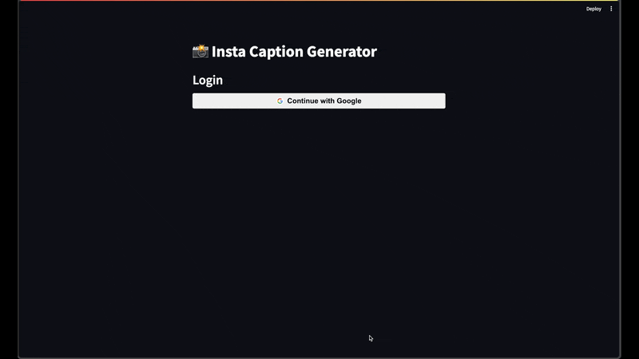

# Instagram Caption Generator

A simple [Streamlit](https://streamlit.io/) Python application to generate interesting Instagram Captions based on images uploaded, using [Google Gemini](https://deepmind.google/technologies/gemini/)



## Usage

1. Clone the repository 
2. Install Python dependencies

```bash
pip install -r requirements.txt
```

3. Duplicate `.env.example` file into `.env` file with your credentials
    a. Google OAuth Login Client - [here](https://console.cloud.google.com/apis/credentials)
    b. Google AI Studio - [here](https://aistudio.google.com/app/apikey)

4. Start the application

```bash
streamlit run main.py
```

5. Go to http://localhost:8501/ in your browser

## License

MIT License
